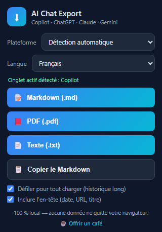

# AI Chat Export — Exporteur de conversations IA / LLM Chat Conversation Exporter

<div align="center">

**Copilot · ChatGPT · Claude · Gemini → Markdown · PDF · TXT**

Extension Chrome, 100 % locale — aucune donnée ne quitte votre navigateur.
Chrome extension, 100% local — no data ever leaves your browser.

☕ Soutenez le développement / Support the development : **[ko-fi.com/tristanlozahic](https://ko-fi.com/tristanlozahic)**

</div>

<p align="center">
  
</p>

---

## 🇫🇷 Français

Exportez une **conversation entière** depuis votre assistant IA préféré vers un
fichier **Markdown (.md)**, **PDF (.pdf)** ou **texte (.txt)**, ou copiez-la
dans le presse-papiers. Interface disponible en **français et anglais**
(suit la langue du navigateur, ou forçage via le menu déroulant).

☕ Si cette extension vous est utile, vous pouvez [soutenir son développement
sur Ko-fi](https://ko-fi.com/tristanlozahic).

### Plateformes prises en charge

| Plateforme | Domaines |
|---|---|
| Copilot | `copilot.com`, `copilot.microsoft.com`, `m365.cloud.microsoft/chat` |
| ChatGPT | `chatgpt.com` (et l'ancien `chat.openai.com`) |
| Claude | `claude.ai` |
| Gemini | `gemini.google.com` |

### Installation (mode développeur)

1. Ouvrez `chrome://extensions`
2. Activez le **Mode développeur** (coin haut droit)
3. Cliquez sur **Charger l'extension non empaquetée**
4. Sélectionnez le dossier `copilot-exporter` (celui qui contient `manifest.json`)
5. (Recommandé) Épinglez l'extension via l'icône puzzle de la barre d'outils

### Utilisation

1. Ouvrez la conversation à exporter dans l'onglet actif
2. Cliquez sur l'icône de l'extension
3. Choisissez la **plateforme** et la **langue** dans les menus déroulants
   (tout deux en « Détection automatique » par défaut)
4. Cliquez sur **Markdown (.md)**, **PDF (.pdf)**, **Texte (.txt)** ou
   **Copier le Markdown**

Le fichier arrive dans vos **Téléchargements** :
`<plateforme>-<titre>-<AAAA-MM-JJ_HH-MM-SS>.<ext>`.

**Images** : les images présentes dans la conversation (générées par l'IA ou
envoyées par vous) sont incluses dans l'export :
- **Markdown / TXT** : téléchargées en fichiers séparés
  (`<fichier>-img01.png`, …) et référencées clairement dans le texte
  (`` en Markdown,
  `[Image 1 — nom-du-fichier.png]` en TXT) — placez le tout dans un même
  dossier et l'export est autonome ;
- **PDF** : embarquées directement dans le document, avec leur nom en
  légende.
Chrome peut demander une confirmation « Télécharger plusieurs fichiers »
(une fois par site). Si une image ne peut pas être récupérée (CORS), son URL
d'origine est conservée dans le texte. Option désactivable dans le popup.

### Comment ça marche

Chaîne de stratégies, de la plus fiable à la plus générique :

1. **API interne Copilot** (copilot.com / copilot.microsoft.com) : historique
   complet en JSON, sans faire défiler la page — réflexions de l'IA, images
   et sources citées incluses.
2. **DOM spécifique à chaque plateforme** (ChatGPT, Claude, Gemini, Copilot)
   puis reconversion en Markdown (titres, listes, blocs de code, tableaux).
3. **Mode brut** (repli) : texte complet de la zone de conversation.

Le PDF est généré par un **moteur PDF autonome** intégré (PDF 1.4, polices
standard) : texte sélectionnable, fichiers légers, pagination, numéros de
page. Limite : les caractères hors alphabet latin occidental y sont
retirés/translittérés — le Markdown reste l'export le plus fidèle.

### Dépannage

- **« L'onglet actif n'est pas une conversation prise en charge »** : ouvrez
  la conversation dans l'onglet actif, F5 si l'extension vient d'être
  installée/mise à jour.
- **Export incomplet** : activez « Défiler pour tout charger », ou remontez
  manuellement en haut de la conversation avant d'exporter.
- **Mode brut au lieu du structuré** : l'interface du site a changé ; adaptez
  la section `SELECTORS` de `copilot-exporter/content.js`.

### Structure du dépôt

```
copilot-exporter/   ← l'extension Chrome (à charger dans chrome://extensions)
  manifest.json     ← Manifest V3
  content.js        ← extraction (API + DOM par plateforme), conversion
  pdf.js            ← générateur PDF autonome
  popup.html/css/js ← interface (menus plateforme/langue, options)
  icons/            ← icônes
tools/              ← scripts de développement (générateur d'icônes…)
docs/               ← captures d'écran (popup, bannière store 1280x800)
```

---

## 🇬🇧 English

Export an **entire conversation** from your favourite AI assistant to a
**Markdown (.md)**, **PDF (.pdf)** or **plain text (.txt)** file, or copy it
to the clipboard. UI available in **French and English** (follows the browser
language by default — English for any non-French browser — or force it from
the dropdown).

☕ If you find this extension useful, you can [support its development on
Ko-fi](https://ko-fi.com/tristanlozahic).

### Supported platforms

| Platform | Domains |
|---|---|
| Copilot | `copilot.com`, `copilot.microsoft.com`, `m365.cloud.microsoft/chat` |
| ChatGPT | `chatgpt.com` (and legacy `chat.openai.com`) |
| Claude | `claude.ai` |
| Gemini | `gemini.google.com` |

### Install (developer mode)

1. Open `chrome://extensions`
2. Enable **Developer mode** (top right)
3. Click **Load unpacked**
4. Select the `copilot-exporter` folder (the one containing `manifest.json`)
5. (Recommended) Pin the extension via the toolbar puzzle icon

### Usage

1. Open the conversation you want to export in the active tab
2. Click the extension icon
3. Pick the **platform** and the **language** in the dropdowns
   (both default to automatic detection)
4. Click **Markdown (.md)**, **PDF (.pdf)**, **Text (.txt)** or
   **Copy Markdown**

The file lands in your **Downloads** folder:
`<platform>-<title>-<YYYY-MM-DD_HH-MM-SS>.<ext>`.

**Images**: images found in the conversation (AI-generated or uploaded by
you) are included in the export:
- **Markdown / TXT**: downloaded as separate files (`<file>-img01.png`, …)
  and clearly referenced by name in the text — keep everything in one folder
  and the export is self-contained;
- **PDF**: embedded directly inside the document, with the file name as
  caption.
Chrome may ask a one-time "Download multiple files" confirmation per site.
If an image cannot be fetched (CORS, expired session), its original URL is
kept in the text. Can be disabled in the popup.

### How it works

Strategies, from most to least reliable:

1. **Copilot internal API** (copilot.com / copilot.microsoft.com): full JSON
   history without scrolling the page — AI thoughts, images and cited sources
   included.
2. **Per-platform DOM extraction** (ChatGPT, Claude, Gemini, Copilot),
   converted back to Markdown (headings, lists, code blocks, tables).
3. **Raw mode** (fallback): full text of the conversation area.

The PDF is produced by a **built-in dependency-free PDF engine** (PDF 1.4,
standard fonts): selectable text, lightweight files, pagination, page
numbers. Limitation: characters outside the Western Latin alphabet are
dropped/transliterated — Markdown remains the highest-fidelity export.

### Troubleshooting

- **“The active tab is not a supported conversation”**: open the conversation
  in the active tab; press F5 if the extension was just installed/updated.
- **Incomplete export**: enable “Scroll to load the full history”, or scroll
  to the top of the conversation manually before exporting.
- **Raw mode instead of structured**: the site UI changed; adapt the
  `SELECTORS` section in `copilot-exporter/content.js`.

### Repository layout

```
copilot-exporter/   ← the Chrome extension (load it in chrome://extensions)
  manifest.json     ← Manifest V3
  content.js        ← extraction (API + per-platform DOM), conversion
  pdf.js            ← standalone PDF engine
  popup.html/css/js ← UI (platform/language dropdowns, options)
  icons/            ← icons
tools/              ← dev scripts (icon generator, screenshot cropper…)
docs/               ← screenshots (popup preview, store banner 1280x800)
```

## Privacy / Confidentialité

- 🇫🇷 Aucune permission réseau dédiée, aucun collecteur, aucun envoi. Tout se
  passe dans l'onglet ; le fichier est créé par le navigateur. Seule exception
  technique : sur Copilot, l'historique est relu depuis l'API de Copilot
  elle-même avec la session de votre onglet, pour un export plus complet.
- 🇬🇧 No dedicated network permission, no tracker, no upload. Everything
  happens in the tab; the file is created by the browser itself. One technical
  exception: on Copilot, the history is re-read from Copilot's own API using
  your tab's session, for a more complete export.
