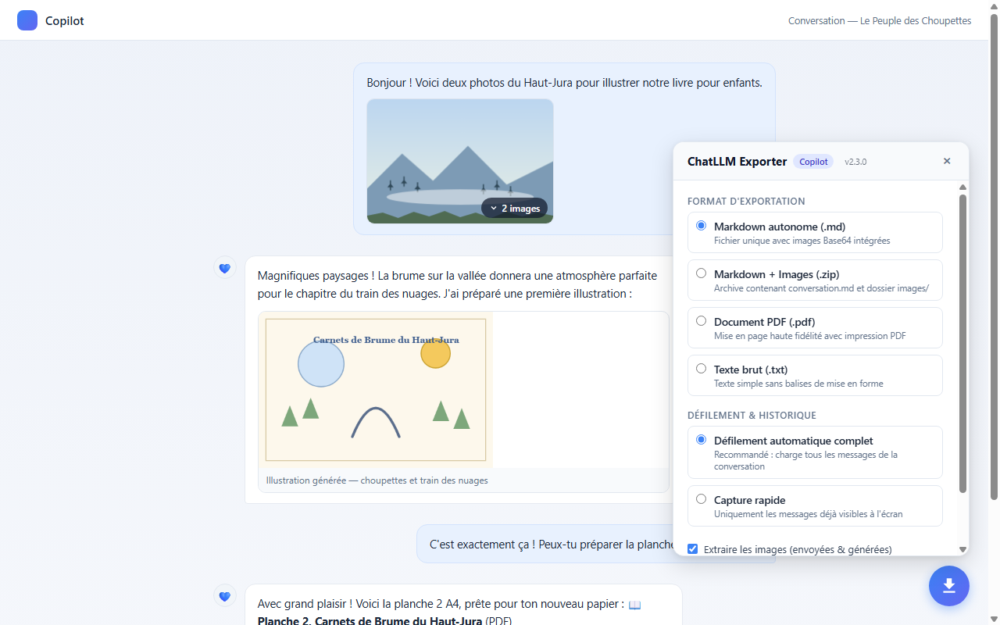
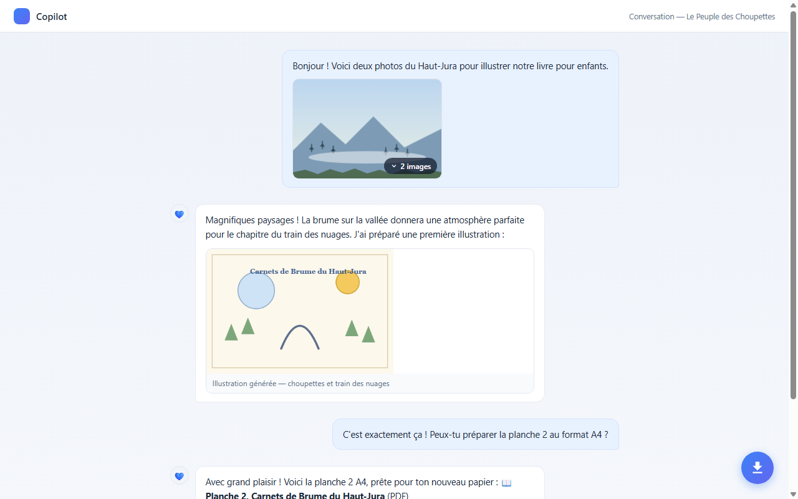
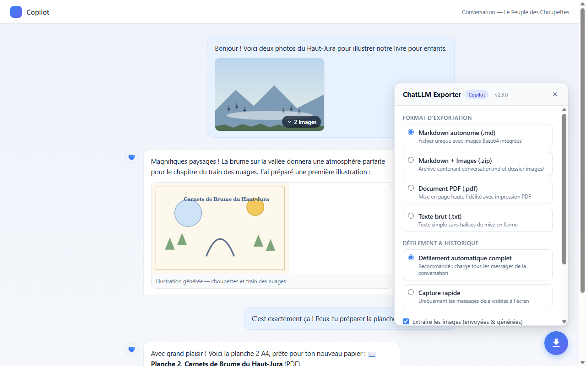

# ChatLLM Exporter — Copilot · Gemini · Claude

<div align="center">

**Copilot · Gemini · Claude → Markdown · PDF · ZIP · TXT — texte + images + planches**

Extension Chrome à interface intégrée dans la page, 100 % locale — aucune donnée
ne quitte votre navigateur.
In-page UI Chrome extension, 100% local — no data ever leaves your browser.

☕ Soutenez le développement / Support the development : **[ko-fi.com/tristanlozahic](https://ko-fi.com/tristanlozahic)**

</div>

<p align="center">
  
</p>

<p align="center">
  
  
</p>

---

## 🇫🇷 Français

**ChatLLM Exporter** exporte une **conversation entière** depuis Microsoft
Copilot, Google Gemini ou Anthropic Claude vers un fichier **Markdown
autonome (.md)**, une **archive ZIP** (Markdown + images), un **document
PDF** stylisé ou un fichier **texte (.txt)** — textes, **images envoyées et
générées**, et même les **planches PDF générées par l'IA**.

Un **bouton flottant bleu** apparaît en bas à droite des sites supportés :
un clic ouvre le panneau d'export, directement dans la page.

### Plateformes prises en charge

| Plateforme | Domaines |
|---|---|
| Copilot | `copilot.com`, `copilot.microsoft.com`, `copilot.cloud.microsoft`, `bing.com` |
| Gemini | `gemini.google.com` |
| Claude | `claude.ai` |

### Installation (mode développeur)

1. Ouvrez `chrome://extensions`
2. Activez le **Mode développeur** (coin haut droit)
3. Cliquez sur **Charger l'extension non empaquetée**
4. Sélectionnez le dossier `plugin_chrome_chatllm_gem` (celui qui contient
   `manifest.json`)

### Utilisation

1. Ouvrez la conversation à exporter
2. Cliquez sur le **bouton flottant bleu** en bas à droite
3. Choisissez le **format** et le **mode de défilement**, laissez
   « Extraire les images » coché
4. Cliquez sur **Démarrer l'extraction** — le panneau affiche la progression
   en temps réel ; le bouton **Arrêter et exporter maintenant** est disponible
   à tout moment

### Formats d'export

| Format | Contenu |
|---|---|
| **Markdown autonome (.md)** | Fichier unique, images intégrées en Base64 — s'ouvre partout (Obsidian, VS Code, Notion…) |
| **Markdown + Images (.zip)** | Archive : `conversation.md` + dossier `images/` + dossier `planches/` (PDF générés) |
| **Document PDF (.pdf)** | Mise en page en bulles prête à imprimer, images intégrées, planches PDF en aperçu intégré |
| **Texte brut (.txt)** | Texte horodaté délimité, images et planches référencées |

### Fonctionnalités clés

- **Scroll & Harvest** : défilement automatique complet de haut en bas pour
  vaincre la virtualisation du DOM (les messages hors écran sont détruits par
  le site) — chaque message est capturé dans l'ordre chronologique exact.
- **Galeries d'images multiples** : quand plusieurs photos sont envoyées dans
  un même message (pile repliée « N images »), l'extension **déplie
  automatiquement** la galerie pendant la capture pour tout récupérer.
- **Images générées** (DALL-E / Designer, Imagen…) **et envoyées**, converties
  en Base64 via Canvas ou le relais du service worker (contournement CORS).
- **Planches PDF générées par l'IA** : les fichiers PDF que Copilot propose en
  téléchargement (liens `blob:` éphémères) sont récupérés pendant l'export et
  embarqués — aperçu intégré dans l'export PDF, fichiers réels dans le ZIP.
- **Anti-doublons** : les messages sont fusionnés par contenu au fil du
  balayage (identifiants stables), même quand les images arrivent après le
  texte.

### Confidentialité

Aucune collecte, aucun serveur, aucun traceur. Tout se passe dans votre
navigateur. Détails : [PRIVACY.md](PRIVACY.md).

### Structure du dépôt

```
plugin_chrome_chatllm_gem/  ← l'extension Chrome (à charger dans chrome://extensions)
  manifest.json              ← Manifest V3
  content/                   ← parseurs par plateforme, balayage, overlay, image processor
  content/formatters/        ← exports TXT / Markdown (inline + zip) / PDF (print)
  background/                ← service worker (téléchargements, relais images)
  popup/, print/             ← interface et page d'impression PDF
copilot-exporter/            ← première version de l'extension (historique)
dist/                        ← zips prêts à installer / publier
docs/                        ← captures d'écran et visuels store
tools/                       ← scripts de développement
```

---

## 🇬🇧 English

**ChatLLM Exporter** exports an **entire conversation** from Microsoft
Copilot, Google Gemini or Anthropic Claude to a **self-contained Markdown
(.md)** file, a **ZIP archive** (Markdown + images), a styled **PDF**
document or a **plain text (.txt)** file — texts, **uploaded and generated
images**, and even **PDF sheets generated by the AI**.

A **blue floating button** appears at the bottom right of supported sites:
one click opens the export panel, right inside the page.

### Supported platforms

| Platform | Domains |
|---|---|
| Copilot | `copilot.com`, `copilot.microsoft.com`, `copilot.cloud.microsoft`, `bing.com` |
| Gemini | `gemini.google.com` |
| Claude | `claude.ai` |

### Install (developer mode)

1. Open `chrome://extensions`
2. Enable **Developer mode** (top right)
3. Click **Load unpacked**
4. Select the `plugin_chrome_chatllm_gem` folder (the one containing
   `manifest.json`)

### Usage

1. Open the conversation you want to export
2. Click the **blue floating button** at the bottom right
3. Pick the **format** and the **scroll mode**, keep
   "Extract images" checked
4. Click **Start extraction** — the panel shows live progress; the
   **Stop and export now** button is always available

### Export formats

| Format | Content |
|---|---|
| **Self-contained Markdown (.md)** | Single file, Base64-embedded images — opens anywhere (Obsidian, VS Code, Notion…) |
| **Markdown + Images (.zip)** | Archive: `conversation.md` + `images/` folder + `planches/` folder (generated PDFs) |
| **PDF document (.pdf)** | Print-ready bubble layout, embedded images, PDF sheets shown as embedded previews |
| **Plain text (.txt)** | Delimited, timestamped text; images and sheets referenced |

### Key features

- **Scroll & Harvest**: full automatic top-to-bottom sweep to defeat DOM
  virtualization (off-screen messages are destroyed by the site) — every
  message captured in exact chronological order.
- **Multi-image galleries**: when several photos are sent in one message
  (collapsed "N images" stack), the extension **automatically expands** the
  gallery during capture to get them all.
- **Generated images** (DALL-E / Designer, Imagen…) **and uploads**, converted
  to Base64 via Canvas or the service-worker relay (CORS workaround).
- **AI-generated PDF sheets**: the PDF files Copilot offers as downloads
  (ephemeral `blob:` links) are fetched during export and embedded — inline
  preview in the PDF export, real files in the ZIP.
- **Duplicate-proof**: messages are merged by content during the sweep
  (stable identifiers), even when images arrive after the text.

### Privacy

No collection, no server, no tracker. Everything happens in your browser.
Details: [PRIVACY.md](PRIVACY.md).

### Repository layout

```
plugin_chrome_chatllm_gem/  ← the Chrome extension (load in chrome://extensions)
  manifest.json              ← Manifest V3
  content/                   ← per-platform parsers, sweep, overlay, image processor
  content/formatters/        ← TXT / Markdown (inline + zip) / PDF (print) exports
  background/                ← service worker (downloads, image relay)
  popup/, print/             ← UI and the PDF print page
copilot-exporter/            ← first version of the extension (legacy)
dist/                        ← ready-to-install / publish zips
docs/                        ← screenshots and store graphics
tools/                       ← dev scripts
```
